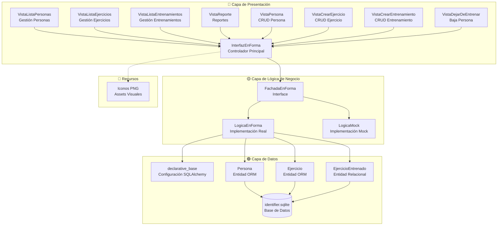
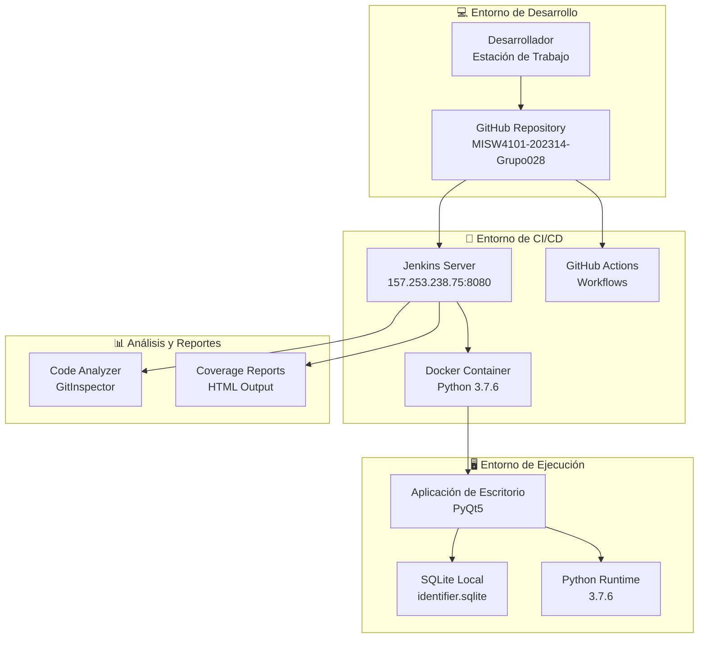
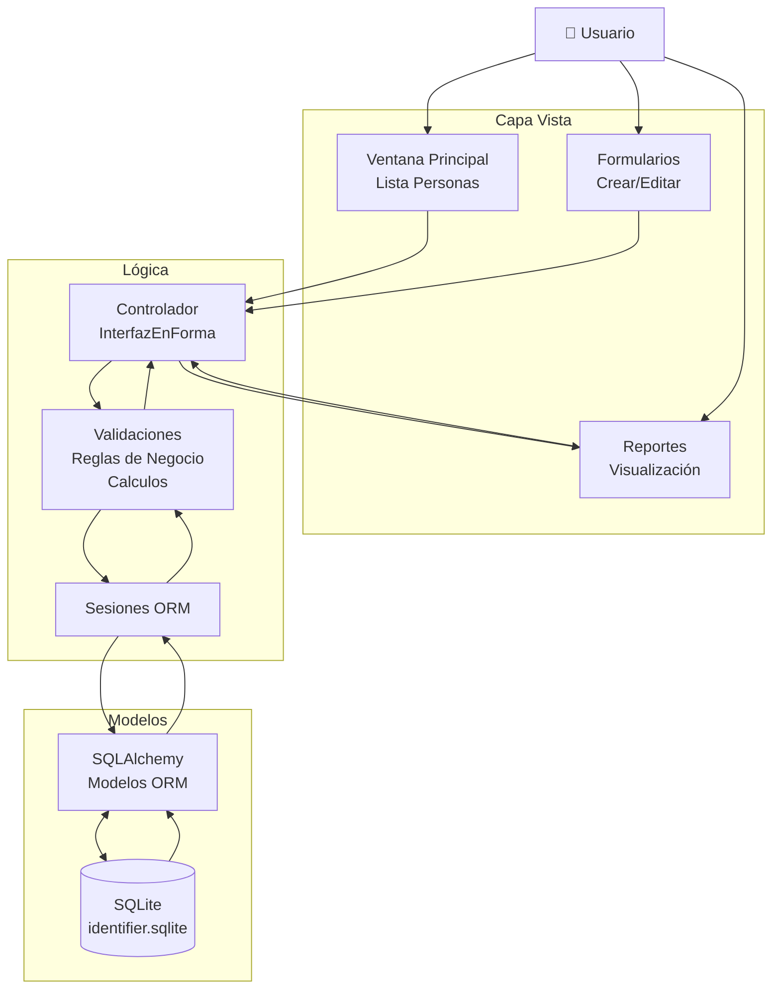
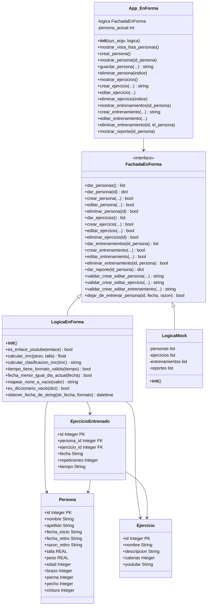
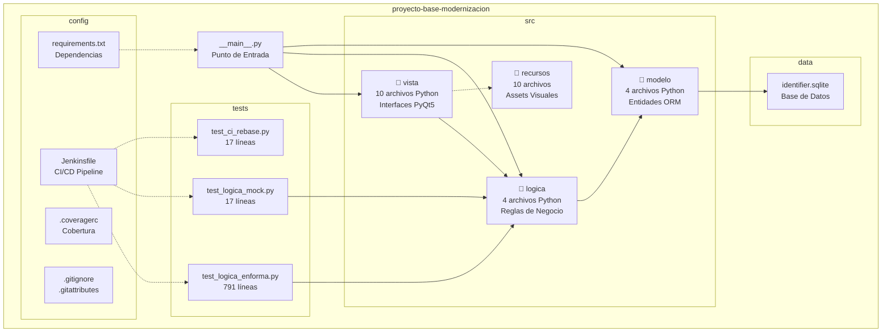
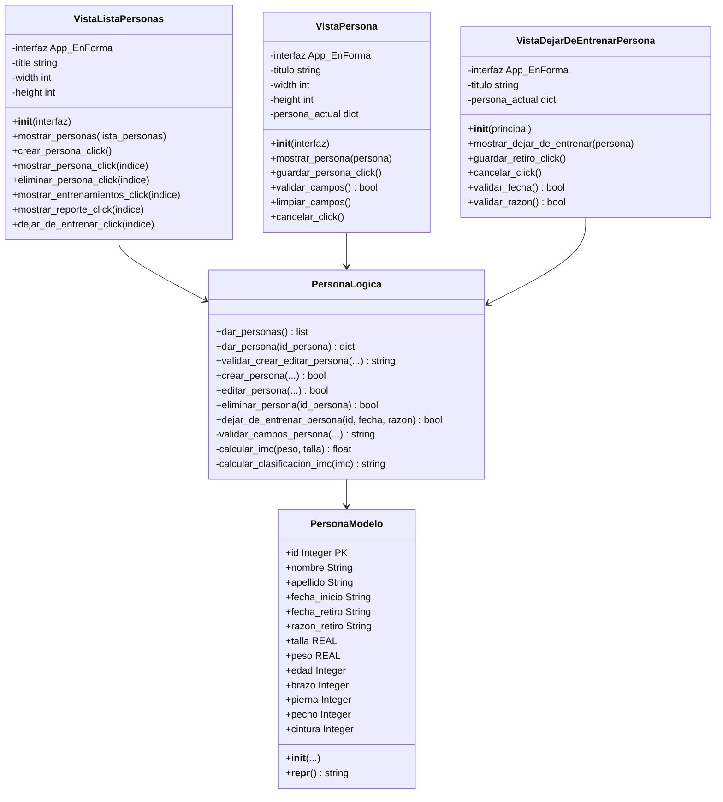
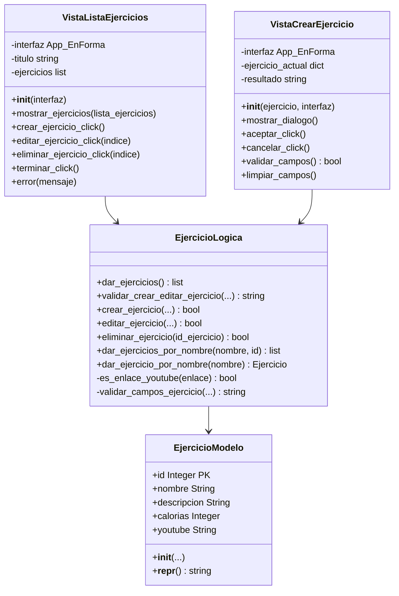
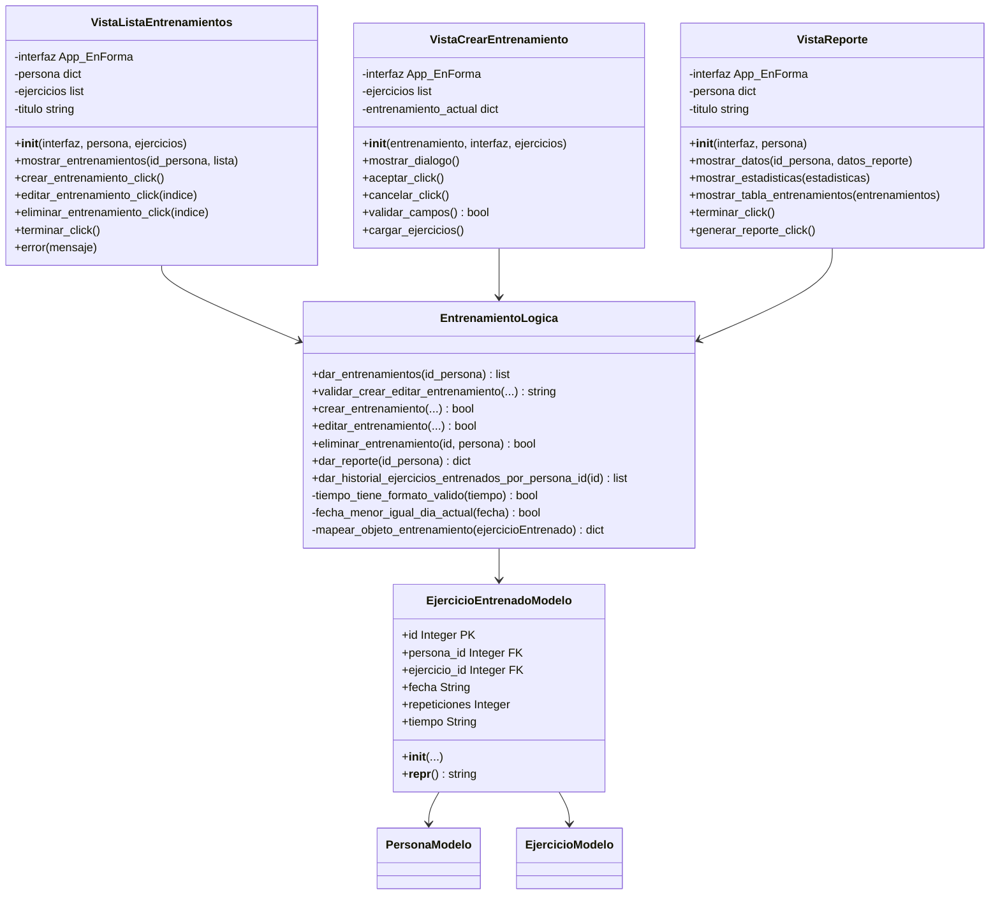
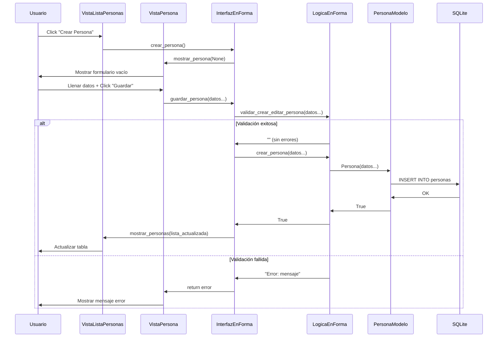
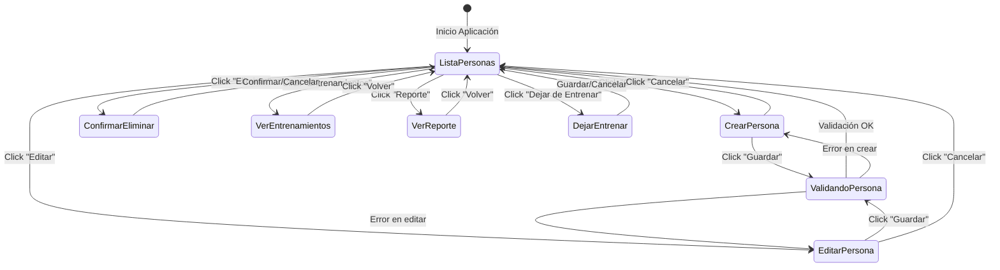

# Estructura de Carpetas y Archivos - Proyecto EnForma

## Diagrama Completo de la Arquitectura del Proyecto

```
proyecto-base-modernizacion/
│
├── 📁 .git/                                    # Control de versiones Git
├── 📁 .github/                                 # Configuración GitHub Actions
│   └── 📁 workflows/                           # Flujos de trabajo CI/CD
│       ├── 📄 merge_on_develop.yml             # Pipeline para merge en develop
│       ├── 📄 merge_on_main.yml                # Pipeline para merge en main
│       └── 📄 push_feature_fix_branch.yml      # Pipeline para ramas feature/fix
│
├── 📁 src/                                     # Código fuente principal (Arquitectura en 3 capas)
│   │
│   ├── 📁 vista/                               # 🔴 CAPA DE PRESENTACIÓN (UI Layer)
│   │   ├── 📄 __init__.py                      # Inicializador del módulo vista
│   │   ├── 📄 InterfazEnForma.py              # Controlador principal de la aplicación (MVC)
│   │   ├── 📄 VistaListaPersonas.py           # Ventana principal - Lista y gestión de personas
│   │   ├── 📄 VistaPersona.py                 # Ventana para crear/editar una persona individual
│   │   ├── 📄 VistaListaEjercicios.py         # Ventana para gestionar catálogo de ejercicios
│   │   ├── 📄 VistaCrearEjercicio.py          # Diálogo modal para crear/editar ejercicios
│   │   ├── 📄 VistaListaEntrenamientos.py     # Ventana para mostrar entrenamientos de una persona
│   │   ├── 📄 VistaCrearEntrenamiento.py      # Diálogo modal para registrar entrenamientos
│   │   ├── 📄 VistaDejarDeEntrenarPersona.py  # Ventana para dar de baja a personas
│   │   └── 📄 VistaReporte.py                 # Ventana para mostrar reportes de progreso
│   │
│   ├── 📁 logica/                              # 🟡 CAPA DE LÓGICA DE NEGOCIO (Business Layer)
│   │   ├── 📄 __init__.py                      # Inicializador del módulo lógica
│   │   ├── 📄 FachadaEnForma.py               # Interfaz abstracta - Patrón Facade (Contrato)
│   │   ├── 📄 LogicaEnForma.py                # Implementación real de reglas de negocio
│   │   └── 📄 LogicaMock.py                   # Implementación mock para testing y desarrollo
│   │
│   ├── 📁 modelo/                              # 🟢 CAPA DE DATOS (Data Access Layer)
│   │   ├── 📄 declarative_base.py             # Configuración SQLAlchemy - Engine y Session
│   │   ├── 📄 persona.py                      # Modelo de datos ORM - Entidad Persona
│   │   ├── 📄 ejercicio.py                    # Modelo de datos ORM - Entidad Ejercicio
│   │   └── 📄 ejercicioEntrenado.py           # Modelo de datos ORM - Entidad EjercicioEntrenado (relación)
│   │
│   └── 📁 recursos/                            # 🎨 RECURSOS ESTÁTICOS (Assets)
│       ├── 📄 Attributions.txt                # Créditos y atribuciones de iconos
│       ├── 🖼️ EnFormaLogo.png                  # Logo principal de la aplicación
│       ├── 🖼️ 002-door-open-fill-icon.png     # Icono para salir/cerrar sesión
│       ├── 🖼️ 004-edit-button.png             # Icono para editar registros
│       ├── 🖼️ 005-delete.png                  # Icono para eliminar registros
│       ├── 🖼️ 006-add.png                     # Icono para agregar nuevos registros
│       ├── 🖼️ 007-back-button.png             # Icono para volver/regresar
│       ├── 🖼️ 010-ejercicio.png               # Icono para ejercicios
│       ├── 🖼️ floppy-disk.png                 # Icono para guardar datos
│       └── 🖼️ reporte.png                     # Icono para generar reportes
│
├── 📁 tests/                                   # 🧪 MÓDULO DE PRUEBAS (Testing Layer)
│   ├── 📄 __init__.py                          # Inicializador del módulo tests
│   ├── 📄 test_logica_enforma.py              # Pruebas unitarias para LogicaEnForma (791 líneas)
│   ├── 📄 test_logica_mock.py                 # Pruebas unitarias para LogicaMock
│   └── 📄 test_ci_rebase.py                   # Pruebas básicas para CI/CD pipeline
│
├── 📄 __main__.py                              # 🚀 PUNTO DE ENTRADA PRINCIPAL de la aplicación
├── 📄 requirements.txt                         # 📦 Dependencias del proyecto (PyQt5, SQLAlchemy, etc.)
├── 📄 identifier.sqlite                        # 🗄️ Base de datos SQLite (persistencia local)
├── 📄 README.md                               # 📖 Documentación del proyecto
├── 📄 architecture.md                         # 🏗️ Análisis arquitectónico del sistema
├── 📄 Jenkinsfile                             # ⚙️ Pipeline de CI/CD para Jenkins
├── 📄 .gitignore                              # 🚫 Archivos ignorados por Git
├── 📄 .gitattributes                          # ⚙️ Configuración de atributos Git
└── 📄 .coveragerc                             # 📊 Configuración para cobertura de código
```

## Descripción Detallada por Capas

### 🔴 **Capa de Presentación (Vista)** - 10 archivos
**Responsabilidad**: Interfaz gráfica de usuario, manejo de eventos, validaciones de entrada

| Archivo | Líneas | Función Principal |
|---------|--------|-------------------|
| `InterfazEnForma.py` | 179 | **Controlador principal** - Coordina todas las ventanas y maneja la comunicación con la lógica |
| `VistaListaPersonas.py` | 210 | **Ventana principal** - Muestra tabla de personas registradas con opciones CRUD |
| `VistaPersona.py` | 173 | **Formulario de persona** - Crear/editar datos personales y medidas corporales |
| `VistaListaEjercicios.py` | 186 | **Gestión de ejercicios** - Catálogo de ejercicios disponibles con enlaces YouTube |
| `VistaCrearEjercicio.py` | 107 | **Diálogo de ejercicio** - Modal para crear/editar ejercicios individuales |
| `VistaListaEntrenamientos.py` | 238 | **Historial de entrenamientos** - Muestra entrenamientos de una persona específica |
| `VistaCrearEntrenamiento.py` | 114 | **Registro de entrenamiento** - Modal para agregar nuevas sesiones de ejercicio |
| `VistaDejarDeEntrenarPersona.py` | 120 | **Baja de persona** - Formulario para dar de baja personas con fecha y motivo |
| `VistaReporte.py` | 194 | **Reportes de progreso** - Muestra estadísticas, IMC y gráficos de rendimiento |
| `__init__.py` | - | **Inicializador** - Configura el módulo de vista como paquete Python |

### 🟡 **Capa de Lógica de Negocio** - 4 archivos
**Responsabilidad**: Reglas de negocio, validaciones, cálculos, patrón Facade

| Archivo | Líneas | Función Principal |
|---------|--------|-------------------|
| `FachadaEnForma.py` | 210 | **Interfaz abstracta** - Define contratos y métodos que deben implementar las clases de lógica |
| `LogicaEnForma.py` | 332 | **Implementación real** - Lógica de negocio completa, validaciones, cálculos IMC, acceso a BD |
| `LogicaMock.py` | 118 | **Implementación mock** - Datos falsos para desarrollo y testing sin base de datos |
| `__init__.py` | - | **Inicializador** - Configura el módulo de lógica como paquete Python |

### 🟢 **Capa de Datos (Modelo)** - 4 archivos
**Responsabilidad**: Persistencia, modelos ORM, relaciones entre entidades

| Archivo | Líneas | Función Principal |
|---------|--------|-------------------|
| `declarative_base.py` | 10 | **Configuración ORM** - Engine SQLAlchemy, Session factory, Base declarativa |
| `persona.py` | 20 | **Entidad Persona** - Modelo ORM con datos personales, medidas, fechas de entrenamiento |
| `ejercicio.py` | 12 | **Entidad Ejercicio** - Modelo ORM para catálogo de ejercicios con enlaces YouTube |
| `ejercicioEntrenado.py` | 13 | **Entidad Relacional** - Modelo ORM que relaciona persona-ejercicio con métricas |

### 🎨 **Recursos Estáticos** - 10 archivos
**Responsabilidad**: Assets visuales, iconografía, documentación de créditos

| Archivo | Tipo | Función |
|---------|------|---------|
| `EnFormaLogo.png` | Imagen | Logo principal de la aplicación |
| `002-door-open-fill-icon.png` | Icono | Salir/cerrar aplicación |
| `004-edit-button.png` | Icono | Editar registros |
| `005-delete.png` | Icono | Eliminar registros |
| `006-add.png` | Icono | Agregar nuevos registros |
| `007-back-button.png` | Icono | Volver/regresar |
| `010-ejercicio.png` | Icono | Representar ejercicios |
| `floppy-disk.png` | Icono | Guardar datos |
| `reporte.png` | Icono | Generar reportes |
| `Attributions.txt` | Texto | Créditos de iconos de Flaticon |

### 🧪 **Módulo de Pruebas** - 4 archivos
**Responsabilidad**: Testing unitario, integración, CI/CD validation

| Archivo | Líneas | Función Principal |
|---------|--------|-------------------|
| `test_logica_enforma.py` | 791 | **Pruebas completas** - Test exhaustivos de toda la lógica real con SQLAlchemy |
| `test_logica_mock.py` | 17 | **Pruebas mock** - Validación de implementación mock y datos de prueba |
| `test_ci_rebase.py` | 17 | **Pruebas CI/CD** - Tests básicos para validar pipeline de integración |
| `__init__.py` | - | **Inicializador** - Configura el módulo de tests como paquete Python |

### 📄 **Archivos de Configuración y Raíz**

| Archivo | Tipo | Función Principal |
|---------|------|-------------------|
| `__main__.py` | Python | **Punto de entrada** - Inicializa la aplicación, configura BD, inyecta dependencias |
| `requirements.txt` | Config | **Dependencias** - PyQt5, SQLAlchemy, coverage, faker, validators |
| `identifier.sqlite` | Database | **Base de datos** - SQLite con datos persistentes de personas, ejercicios, entrenamientos |
| `Jenkinsfile` | Pipeline | **CI/CD** - Pipeline con checkout, tests, cobertura, análisis de código |
| `.coveragerc` | Config | **Cobertura** - Configuración para medir cobertura de código en tests |
| `.gitignore` | Config | **Git ignore** - Archivos excluidos del control de versiones |
| `.gitattributes` | Config | **Git attributes** - Configuración de normalización de archivos |

## Diagramas de Arquitectura en Mermaid.js

### 1. Diagrama de Componentes



### 2. Diagrama de Despliegue



### 3. Diagrama de Flujo de Datos



### 4. Diagrama de Clases Principal



### 5. Diagrama de Paquetes



### 6. Diagrama de Clases por Dominio - Persona



### 7. Diagrama de Clases por Dominio - Ejercicio



### 8. Diagrama de Clases por Dominio - Entrenamiento



### 9. Diagrama de Secuencia - Crear Persona



### 10. Diagrama de Estados - Gestión de Persona


